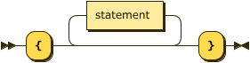
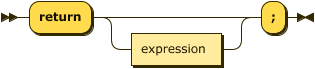

# EBNF grammar for SimpleLanguage

The following diagrams have been generated from file [**`SimpleLanguage.ebnf`**](SimpleLanguage.ebnf) using [Railroad Diagram Generator](https://www.bottlecaps.de/rr/ui).

| *Rule* | *Diagram* |
| :----- | :-------- |
| **simplelanguage** |  |
|  **function** |  |
| **block** |  |
| **statement** |  |
| **while_statment** |  |
| **if_statement** |  |
| **condition** |  |
| **return_statement** |  |
|  **expression** |   |
|  **logic_term** |   |
| **logic_factor**           |  |
|    **arithmetic** |  |
|    **term** |  |
| **factor**             |  |
| **LETTER** |  |
| **DIGIT** |   |
|    **IDENTIFIER** |  |
| **STRING_LITERAL** |  |
| **NUMERIC_LITERAL** | generated by <a name="Railroad-Diagram-Generator" title="https://www.bottlecaps.de/rr/ui" href="https://www.bottlecaps.de/rr/ui" target="_blank">Railroad Diagram Generator </a> |

&nbsp;

SL built-in functions are:

| *Signature* | *Example* |
| :---------- | :-------- |
| <a href="../../language/src/main/java/com/oracle/truffle/sl/builtins/SLDefineFunctionBuiltin.java" title="SLDefineFunctionBuiltin.java"><code>defineFunction(String code)</code></a> | <a href="../../language/tests/DefineFunction.sl" title="DefineFunction.sl"><code>defineFunction("function f(a, b) { return a + b; }");</code></a>
| <a href="../../language/src/main/java/com/oracle/truffle/sl/builtins/SLEvalBuiltin.java" title="SLEvalBuiltin.java"><code>eval(String id, String code): Object</code></a> | <a href="../../language/tests/Eval.sl" title="Eval.sl"><code>eval("sl", "function foo() { return 14 + 2; }");</code></a> |
| <a href="../../language/src/main/java/com/oracle/truffle/sl/builtins/SLGetSizeBuiltin.java" title="SLGetSizeBuiltin.java"><code>getSize(Object o): long</code></a> | &nbsp; |
| <a href="../../language/src/main/java/com/oracle/truffle/sl/builtins/SLHasSizeBuiltin.java" title="SLHasSizeBuiltin.java"><code>hasSize(Object o): boolean</code></a> | &nbsp; |
| <a href="../../language/src/main/java/com/oracle/truffle/sl/builtins/SLImportBuiltin.java" title="SLImportBuiltin.java"><code>import</code></a> | <a href="../../language/src/test/java/com/oracle/truffle/sl/test/PassItselfBackViaContextTest.java#L94"><i>(see example in PassItselfBackViaContextText)</i></a> |
| <a href="../../language/src/main/java/com/oracle/truffle/sl/builtins/SLIsExecutableBuiltin.java" title="SLIsExecutableBuiltin.java"><code>isExecutable(Object o): boolean</code></a> | &nbsp; |
| <a href="../../language/src/main/java/com/oracle/truffle/sl/builtins/SLIsNullBuiltin.java" title="SLIsNullBuiltin.java"><code>isNull(Object o): boolean</code></a> | &nbsp; |
| <a href="../../language/src/main/java/com/oracle/truffle/sl/builtins/SLNanoTimeBuiltin.java"><code>nanoTime(): long</code></a> | <a href="../../language/tests/Builtins.sl" title="Builtins.sl"><code>nanoTime()</code></a> |
| <a href="../../language/src/main/java/com/oracle/truffle/sl/builtins/SLNewObjectBuiltin.java" title="SLNewObjectBuiltin.java"><code>new(): Object</code></a> | <a href="../../language/tests/Object.sl" title="Object.sl"><code>obj1 = new();</code> <code>obj1.x = 42;</code> <code>println(obj1.x);</code></a> |
| <a href="../../language/src/main/java/com/oracle/truffle/sl/builtins/SLPrintlnBuiltin.java" title="SLPrintlnBuiltin.java"><code>println(long value)</code> <code>println(boolean value)</code> <code>println(String value)</code> <code>println(Object value)</code></a> | <a href="../../language/tests/Builtins.sl" title="Builtins.sl"><code>println("Hello World!")</code></a> |
| <a href="../../language/src/main/java/com/oracle/truffle/sl/builtins/SLReadlnBuiltin.java" title="SLReadlnBuiltin.java"><code>readln(): String</code></a> | &nbsp; |
| <a href="../../language/src/main/java/com/oracle/truffle/sl/builtins/SLStackTraceBuiltin.java" title="SLStackTraceBuiltin.java"><code>stacktrace(): String</code></a> | &nbsp; |
| <a href="../../language/src/main/java/com/oracle/truffle/sl/builtins/SLWrapPrimitiveBuiltin.java" title="SLWrapPrimitiveBuiltin.java"><code>wrapPrimitive</code></a> | &nbsp; |

***

